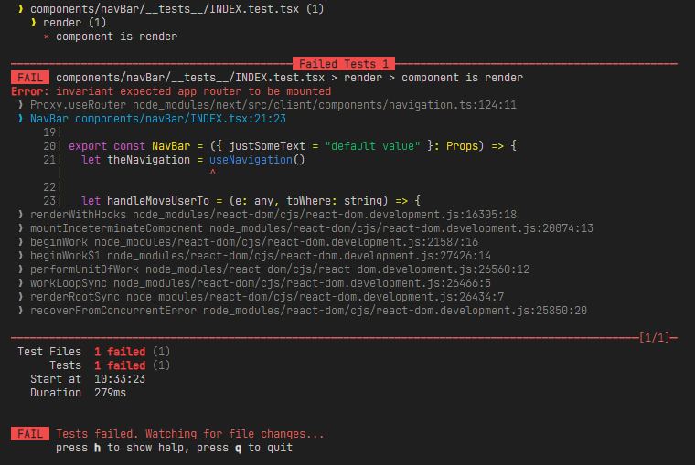
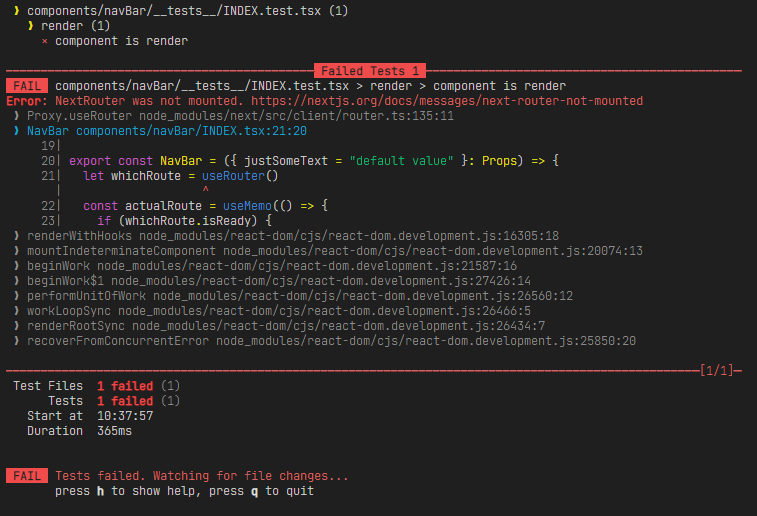

# How to use react-testing-library, vitest and routes in Nextjs

If you try to render a component on `react-testing-library` and that component use a `next/router` or `next/navigation` is possible you face this error:





## You have to use this code to solve it

```typescript

// test-util-nextjs.ts

import { vi } from "vitest"

/* export it to use it in your tests */
export const nextJSRoutesFix = (): void => {
  vi.mock("next/navigation", async () => {
    const actual = await vi.importActual("next/navigation") /* This work for next/navigation */
    return {
      ...actual,
      useRouter: vi.fn(() => ({
        push: vi.fn(),
        replace: vi.fn(),
      })),
      useSearchParams: vi.fn(() => ({
        // get: vi.fn(),
      })),
      usePathname: vi.fn(),
    }
  })
  
  vi.mock("next/router", async () => {
    const actual = await vi.importActual("next/router") /* This work for next/routerr */
    return {
      ...actual,
      useRouter: vi.fn(() => ({
        push: vi.fn(),
        replace: vi.fn(),
      })),
      useSearchParams: vi.fn(() => ({
        // get: vi.fn(),
      })),
      usePathname: vi.fn(),
    }
  })
}

```
And that code can work on every test you made importing it and making your tests

```typescript

// your-test-file.test.tsx
import { nextJSRoutesFix } from "@/utils/test-util-nextjs"

nextJSRoutesFix()

describe('Your suite test here', (ctx_describe) => {
  it('Some individual test', (ctx_it) => {
    // Testing...
  }) 
})
```

And finally, to make `vitest` recognize the import there, you have to make add this on your `vitest.config.ts`:

```typescript
//vitest.config.ts

import { resolve } from "path"

export default defineConfig({
  /* config here */
  resolve: {
    alias: [
      {
        find: "@",
        replacement: resolve(__dirname, "./"),
      },
    ],
  },
})

```
## This approach asume a `tsconfig.json` like this:

```typescript

{
  "compilerOptions": {
    /* some config */
    "paths": {
      "@/*": [
        "./*"
      ]
    }
  }
}

```


### Credits
Source: stsiarzhanau, Dec 14, 2023, link: https://stackoverflow.com/a/77661187/13316519